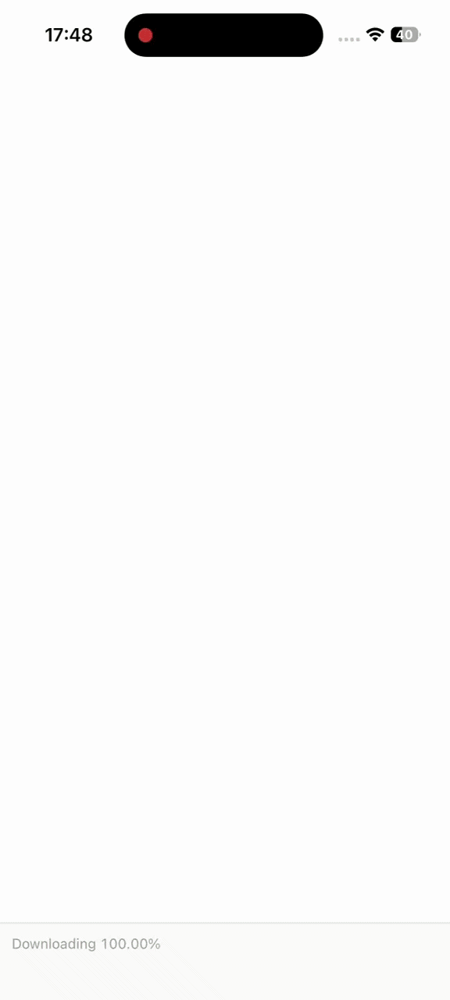

# PlantTracker 🌱
<p align="center">
  
</p>
<p align="center"> </p>

A pixel-art themed plant care app built with React Native and Expo. Track your houseplants, get watering reminders, and enjoy a retro 8-bit aesthetic.

## Demo
Live preview:
[👁️ planttrackerapp.vercel.app](https://planttrackerapp.vercel.app/)

---

## About
This project was developed as a mobile-first plant care app to practice building a cross-platform React Native application with Expo Router.
The app features a pixel-art UI with animated SVG plants, a watering tracker with a visual progress gauge, and local push notifications for watering reminders. State is persisted locally with Zustand and AsyncStorage, and the architecture is modular so it's easy to extend with new plant types, reminder schedules, or a backend sync layer.

---

## Features
* Plant management — add, view, and remove plants with custom names, species, and icons
* Watering tracker — visual progress gauge that fills from green to terracotta as watering day approaches
* Push notifications — local reminders when a plant needs water
* Days ago selector — adjust when a plant was last watered with a +/- pixel button
* Animated pixel plant — SVG plant with leaves that sway pixel-by-pixel
* Pixel art UI — hard shadow buttons, VT323/Silkscreen fonts, flat colors, no rounded corners
* Background animation — Minecraft-style pixel grid that blinks in green, yellow, and brown

---

## Tech Stack
### Framework
* Expo SDK 54
* Expo Router (file-based routing)
* React Native 0.81
* TypeScript

### State
* Zustand
* AsyncStorage (persistence)

### UI & Animation
* react-native-svg
* react-native-reanimated

### Notifications
* expo-notifications

---

## Requirements
Before running the project locally, make sure you have:
* Node.js 18+
* npm
* Expo CLI (`npx expo`)
* Android Studio or Xcode (for emulator/simulator), or the Expo Go app on a physical device

---

## Installation
Clone the repository:
```bash
git clone https://github.com/NiushaEbrahimi/Plant-Tracker-React-Native.git
cd PlantTracker
```
Install dependencies:
```bash
npm install
```

---

## Running the Application
Start the dev server:
```bash
npx expo start
```
Run on Android:
```bash
npx expo start --android
```
Run on iOS:
```bash
npx expo start --ios
```
Run on web:
```bash
npx expo start --web
```

---

## Project Structure
```
PlantTracker/
├── app/                    # Expo Router screens
│   ├── _layout.tsx         # Root layout, fonts, notifications setup
│   ├── index.tsx           # Home screen — plant list + background
│   ├── add.tsx             # Add plant modal — icon picker, interval selector
│   └── plant/[id].tsx      # Plant detail — stats, water button, days ago picker
├── src/
│   ├── components/
│   │   ├── Pixel.tsx       # PixelButton + PixelPanel (hard shadow UI primitives)
│   │   ├── PlantCard.tsx   # List card with water ring + quick water button
│   │   ├── WaterRing.tsx   # Square progress gauge that fills from bottom
│   │   ├── EmptyState.tsx  # Empty list state with hint
│   │   ├── PixelPlant.tsx  # Animated SVG plant with swaying leaves
│   │   └── BackgroundAbsolute.tsx  # Blinking pixel grid background
│   ├── store/
│   │   └── usePlantStore.ts  # Zustand store — plants, water, notifications
│   ├── types/
│   │   └── plant.ts        # Plant + PlantIcon types
│   ├── data/
│   │   └── samplePlants.ts # Starter plants
│   ├── theme/
│   │   ├── colors.ts       # Color tokens + pixel metrics
│   │   └── typography.ts   # Font scale (Silkscreen display, VT323 body)
│   └── utils/
│       ├── plantIcons.tsx  # Plant icon images + component
│       ├── dateHelpers.ts  # Watering progress, status labels, formatting
│       └── notifications.ts # Notification scheduling + permissions
└── assets/
    └── images/             # Plant icon PNGs (monstera, cactus, fern, etc.)
```

---

## Design System
All UI follows pixel-art rules:
* No border radius — everything is sharp rectangles
* Hard shadows — solid offset blocks behind buttons and panels (no blur)
* Flat colors — no gradients, no opacity shadows
* Fonts — Silkscreen (display/buttons), VT323 (body text)
* Border width — always 3px

---

## License
MIT
